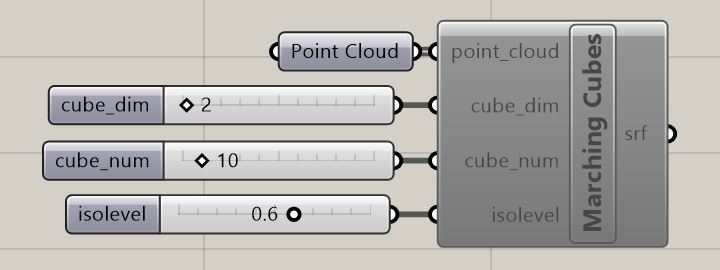

# Marching Cubes Implementation for Grasshopper and Rhinoceros

## Citation

Marching Cubes algorithm was introduced by Lorensen and Cline in 1987. Please visit https://dl.acm.org/citation.cfm?id=37422 for the details.

## Prerequisites

Rhinoceros v.5/v.6

IronPython >= 2.7

GHPython

## Installation

Open Rhinoceros and Grasshopper.

Drag "MarchingCubes.p2.7.5.0.ghpy" file directly into the Grasshopper window.

Just in case the failure of installation in Rhinoceros v5., "marchingcubes_rhino_gh.py" code can be copied into GHPython component. 

## Usage

After installation, open Rhinoceros and Grasshopper.

Marching Cubes component will be under **Mesh > Triangulation**

Decide the variables below and link them to the component: 

    point_cloud : Raw point cloud data

    cube_dim : Integer for cube dimension

    cube_num : Desired total number of cubes

    iso_level : Float for isolevel